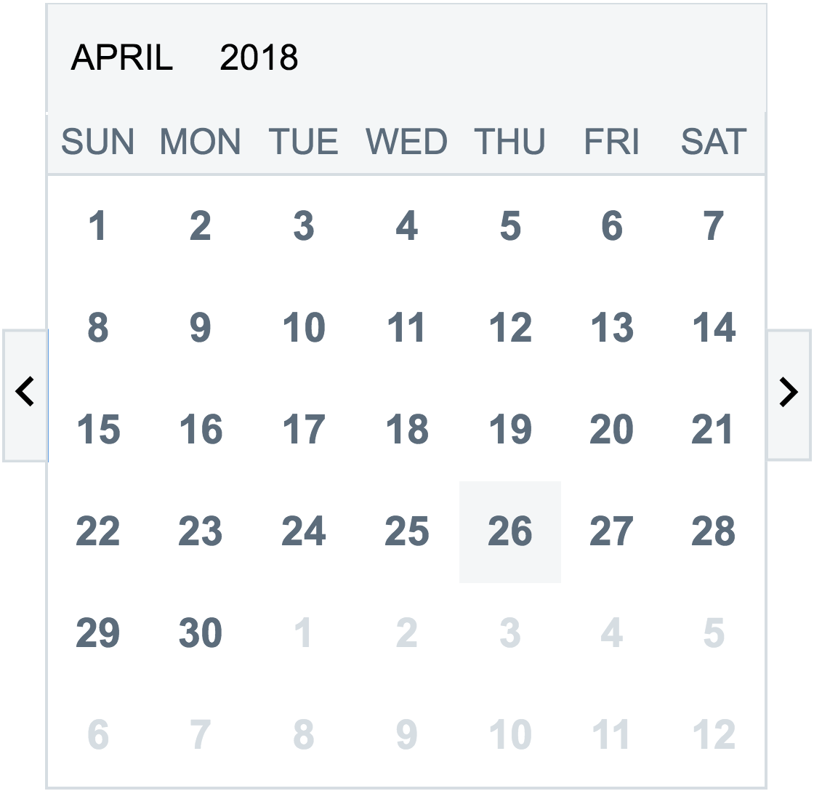
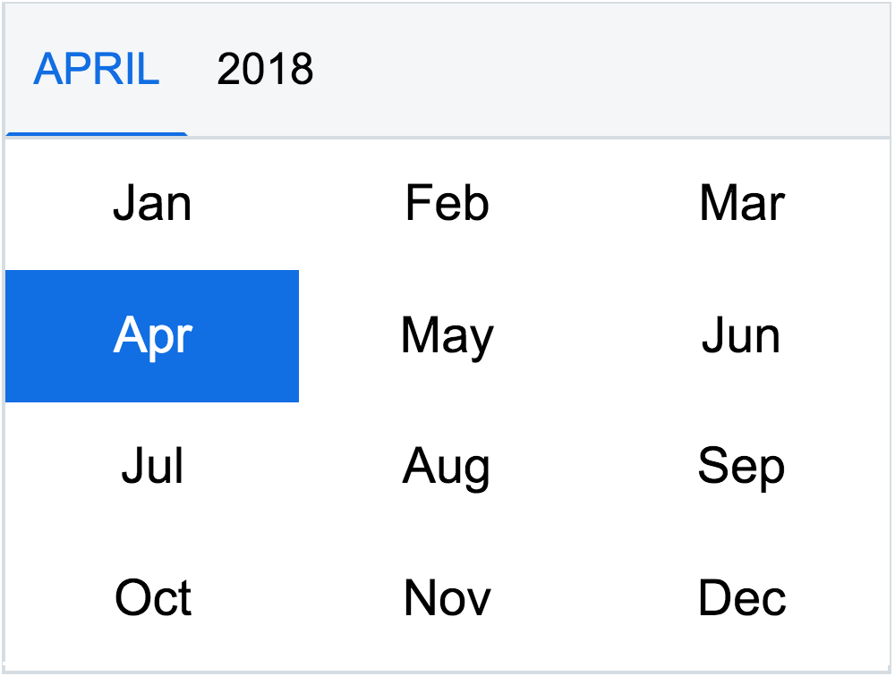

# @dojo/widgets/calendar widget
Dojo 2's `Calendar` renders a date grid with a dropdown month and year picker. The displayed month and year are controlled via properties, defaulting to the current day. Given the limitations of scaling date grid while maintaining usability, the calendar is not fully responsive at small screen sizes; it is instead recommended to switch to an alternative date picker for mobile.

## Features

- Renders a date grid with weekday headers, defaulting to the current month



- Clicking on the current month label opens a month picker that allows you to infinitely cycle through years and choose a month



### Keyboard Usage
- All controls are in the tab order and accessible by keyboard
- Arrow keys move focus in the date grid, and navigating to a disabled date updates the month
- Page up and page down move to the first and last date in the month
- Arrow keys change the year within the month control popup

### Accessibility Features
- The month label is read by screen readers when updated through `aria-live: polite`
- The month popup trigger, year control, month radios, and previous/next month arrows all have screen-reader-accessible labels and instructions
- The weekdays and month radios are marked up with `<abbr>` tags that contain unabbreviated titles
- Focus is controlled when opening and closing the month popup

### i18n Features
- Localized versions of `CalendarMessages`, `monthNames`, and `weekdayNames` can be passed in via properties.

## Example Usage

*Basic Example*
```js
w(Calendar, {
	month: this.state.month,
	selectedDate: this.state.selectedDate,
	year: this.state.year,
	onMonthChange: (month: number) => { this.setState({ 'month': month }); },
	onYearChange: (year: number) => { this.setState({ 'year': year }); },
	onDateSelect: (date: Date) => {
		this.setState({ 'selectedDate': date });
	}
})
```

*Example with custom month heading, custom weekday format, and an extended CalendarCell widget with custom content*
```js
class MyCalendarCell extends CalendarCell {
	formatDate(date: number): DNode {
		const { selected } = this.properties;
		return v('div', [
			`${date}`,
			selected ? w(Icon, { type: 'checkMark' }) : null
		]);
	}
}

[ ... ]

w(Calendar, {
	CustomDateCell: MyCalendarCell,
	month: this.state.month,
	selectedDate: this.state.selectedDate,
	year: this.state.year,
	renderMonthLabel: (month: number, year: number) => {
		// Instead of e.g. "March 2017", you would get 3-2017
		return `${month + 1}-${year}`;
	},
	renderWeekdayCell: (day: { short: string; long: string; }) => {
		// Labels weekdays with only their first letter
		return day.short.substring(0,1);
	},
	onMonthChange: (month: number) => { this.setState({ 'month': month }); },
	onYearChange: (year: number) => { this.setState({ 'year': year }); },
	onDateSelect: (date: Date) => {
		this.setState({ 'selectedDate': date });
	}
})
```
